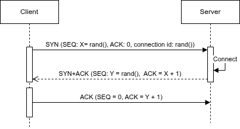
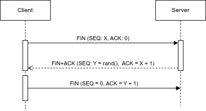
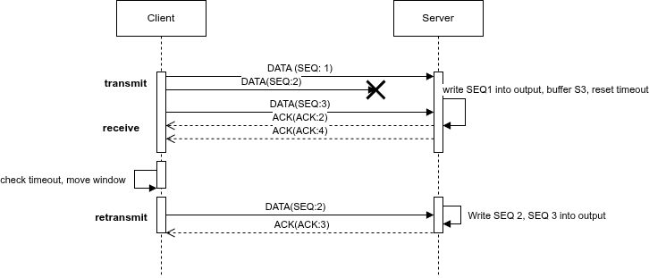

# IPK project 2 - Reliable File Transfer over UDP

## Overview

This project implements a simple reliable transfer over UDP protocol. 
Protocol safely transfers files despite packet loss, duplicates, corruption and reordering.
The protocol is inspired by TCP heavily, essentially making it simpler TCP and it uses selective repeat principle for sending the data.
My main implementation goal was not using heap allocation at all, so project only uses *static allocation* and *stack*.


## Build

Program can be compiled by running command `make` inside the root of the repository.
```bash
make
```

To remove everything created by `make` run `make clean`.
```bash
make clean
```

## Usage - copied and edited from IPK-2 README

Project can be run as both client and server. 
User must use atleast one type and the meaning of arguments will differ for different type.

**Server**
```bash
./ipk-rdt -s -p PORT [-a ADDRESS] [-o OUTPUT] [-w TIMEOUT] [-h | --help]
```

**Client**
```bash
./ipk-rdt -c -a HOST -p PORT [-i INPUT] [-w TIMEOUT] [-h | --help]
```

### Arguments
| Argument | Description |
|----------|-------------|
| `-h` or `--help` | Writes usage instructions to stdout and exits with code 0. |
| `-s` | Starts the receiving (server) side of the application. |
| `-c` | Starts the sending (client) side of the application. |
| `-p PORT` | Specifies the UDP port number. |
| `-a ADDRESS` (server mode) | Local bind address. If omitted, listens on all local addresses. |
| `-a HOST` (client mode) | Destination hostname or IPv4/IPv6 address. If multiple addresses resolve, at least one must be tried. |
| `-i INPUT` | Input file to send. If omitted or `-`, reads from stdin. |
| `-o OUTPUT` | Output file to write received data. If omitted or `-`, writes to stdout. |
| `-w TIMEOUT` | Timeout in seconds (positive integer). Default is `1`. |

**Required arguments**
Atleast one of `-c` or `s`, port `p`, address `-a` for client only.

`Arguments may be in any order`

### Examples

```bash
# File to file transfer
./ipk-rdt -s -p 9000 -o received.bin
./ipk-rdt -c -a 127.0.0.1 -p 9000 -i sample.bin
```
```bash
# Stdin to Stdout transfer
./ipk-rdt -s -p 9000
printf 'IPK\n' | ./ipk-rdt -c -a 127.0.0.1 -p 9000
```

## Header format
Header format was taken from the TCP header format and simplified for this assignment.
Header format is specified as:

<pre>
 <--------------------32 bits------------------------->

 |----------------------------------------------------|
 |               connection id                        |
 |----------------------------------------------------|
 |               sequence number                      |
 |----------------------------------------------------|
 |              acknowledgment number                 |
 |----------------------------------------------------|
 |    checksum-16bits    |       payload_size-16bits  |
 |----------------------------------------------------|
 | flags-8bits  |          padding-24bits             |
 |----------------------------------------------------|
</pre>
Where:
- **connection id**: Connection between client and server, in this program only one connection may happen, used for checking malformed headers.
- **sequence number**: Sequence number of the current packet, used for ordering.
- **acknowledgment number**: Used for acknowledging messages during handshake or teardown or in data transfer.
- **checksum (16 bits)**: Used for corruption detection.
- **payload_size (16 bits)**: Size of the payload in bytes, maximum 1024.
- **flags (8 bits)**: Control flags for managing the connection and packet state taken from TCP - SYN, ACK, RST, FIN, DATA.
- **padding (24 bits)**: Alignemt to 32 bits.

Maximum packet size is 1044 bytes
## Session Establishment and termination

### Client

- **Establishment**: Client firstly generates random connection number and starting sequence number, and sets timeout for recv function in socket.
                    After that client sends SYN packet with filled connection number and sequence number and waits for response SYN + ACK. If no response comes in recv timeout, client retransmits SYN packet until SYN + ACK. After SYN + ACK number with correct acknowledgment number comes, client sends ACK response and moves onto data transfer.
- **Termination**: programmed EXACTLY like establishment but instead of SYN client sends FIN and waits for FIN + ACK.

### Server
- **Establishment**: Server waits until timeout for SYN message, after receiving it, server connects to corresponding address the message came from, generates its own random sequence number and sends sequence number from client + 1 as acknowledgment number back and and corrseponding connection id and sequence number as SYN + ACK response. After that it waits for ACK message, with acknoledgemnt number as its own sequence number or DATA message due to ACK message being lost.

- **Termination**: Works very similar to establishment but without connection creation on socket, last timeout will result in success. And instead of SYN server works with FIN.




## Sequencing and Acknowledgement Strategy

Sequence number starts at random value chosen by client using rand() function. Each part of program holds next expected sequence number. When client sends message(or multiple messages due to selective repeat) with corresponding sequence number, it stores the message into window buffer and waits if corresponding acknowledgment number (seq + 1) comes back. If it does the message is marked as ACK and window knows it can move this message out of window and continue onto next sequence number.
For server it works similarly but instead of generating sequence number, first sequence number is taken from first message of client SYN, when sequence number comes server only stores the message in buffer based on the sequence number and sends ACK = SEQ + 1 back.

## Retransmission strategy and timeout handling
All message sending uses both *global timeout* (chosen by `-w` parameter) and *per message timeout*.
Global timeout is used for overall progress timing like progression of handshake, message sending and teardown.
Per message timeout is used on each message, tracking their *last sent* time, if that timeout passes they are resend. This type of retransmits is used only by client. Server just sends replies to whichever correct message comes.

## Duplicate and Out-of-Order Packet handling
Both client maintain window(buffer) of chosen size.
For server packet handlin is defined as such:
 - Packet within window -> buffer, ACK message back.
 - Packet below window(lower seq) -> ACK message back.
 - Packet above window(higer seq) -> ignored.

Duplicates are not handled. They are implicitly ignored - server just sets corresponding flag buffer item FULL to 1.

Client works on principle of setting flags, so like server with duplicates only flag is set so both duplicate and out-of-order packets are implicitly ignored.

## Connection identification strategy

Client generates a random connection id before the actual transfer. The connection id is used until the end of communication by both client and server. Any packet with invalid connection id is ignored instantly after receiving it.

## Segment size and Window behavior
### Segment size
Segment size is 1024 bytes. The size was chosen due to it being highest power of 2 which will fit in the 1200 limit.

### Window behavior
Window behaves based on merged copy of selective repeat method which I have taken from IPK lectures and Wikipedia.
For client selective repeat works in a loop. Each iteration loop firstly sends all packets in order until window is full, after that it checks for responses from server and sets ACK flag for corresponding entries in window and resets progress timer. After that it retransmits all entries that have set to be ACKed. Last thing it does is check for timeout and moves the window based on ACKed entries.

For server its simpler. Server just receives messages, for each message it buffers the entry into buffer based on SEQ number, sends ACK back, checks for timeout, moves window.



## Known Limitations
Window size and Retransmit time are constants, they are not modifiable in runtime by input.

Precise timeout may be missed due to complex while loops.

Signal handling is done only in While loops, raising a signal elsewhere may cause the signal to be acknowledged later.

Transfer is much slower in environments with higher packet loss/jitter/delay.


## Testing

## AI usage
Parts of this project were created with AI assistance (Claude):

- test.sh - Testing script was generated by AI based on specified test suite, verified.
- README, CHANGELOG outline and formatting.
- Explaining TCP protocol, handshake, teardown, establishing connection.

## Resources

- **RFC 793**: Transmission Control Protocol. IETF, 1981.  
  https://www.rfc-editor.org/rfc/rfc793

- **RFC 1071**: Computing the Internet Checksum. IETF, 1988.  
  https://www.rfc-editor.org/rfc/rfc1071

- **C signal handling**: https://en.wikipedia.org/wiki/C_signal_handling

- **Selective Repeat**: https://en.wikipedia.org/wiki/Selective_Repeat_ARQ

- **TCP 3-Way handshake process**: https://www.geeksforgeeks.org/computer-networks/tcp-3-way-handshake-process/